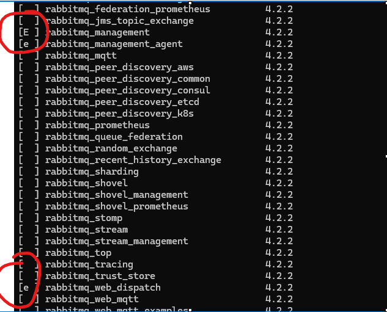

## Enabling RabbitMQ Management Plugin (Windows)

### 1. Navigate to the RabbitMQ `sbin` folder

```text
C:\Program Files\RabbitMQ Server\rabbitmq_server-4.2.2\sbin
```
#### 2 List all the plugins 

sbin> rabbitmq-plugins.bat list

### 3. Enable the rabittmq management plugin

sbin>rabbitmq-plugins.bat enable rabbitmq_management

### 4. verify that plugin is now enabled..

rabbitmq-plugins.bat list



### Now go to the start menu and  stop the rabitt mq

Now restart the rabittmq service

Now go to  127.0.0.1 :15672  and use deafult credentials   guest/guset

